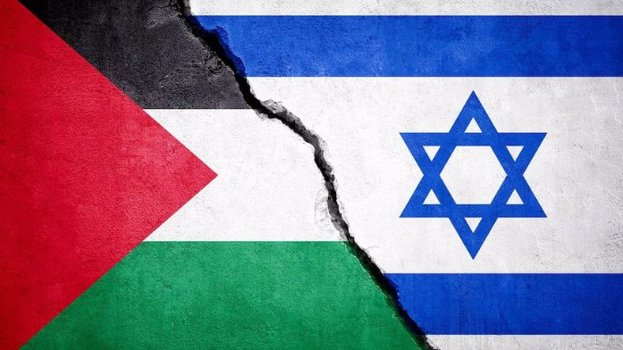

Denne tweeten er adressert til ikke-arabiske Twitter- brukere

Hvis du ikke vet hele sannheten, her er et enkelt historisk sammendrag for å avklare ting for deg

2(Den pågående krigen mellom Israel og Palestina er ikke en krig mellom to stater, så angrepet fra den palestinske motstanden er ikke en krigserklæring, men bare en reaksjon på ...

brudd som har pågått i mer enn 70 år.

3(I mer enn et århundre var de palestinske områdene underlagt det osmanske riket

Under første verdenskrig, med imperiets sammenbrudd, ble Storbritannia betrodd verdens undergang.

4(I 1917 erklærte den britiske utenriksministeren i et brev til Lionel Rothschild sin fulle støtte til opprettelsen av en jødisk stat på de palestinske områdene.

Vi kaller dette løftet "Et løfte fra noen som ikke eier til noen som ikke fortjener"

5(Ved begynnelsen av implementeringen av dette skjebnesvangre løftet var antallet jøder i Palestina 7%, denne prosentandelen økte til 28% av den totale befolkningen etter immigrasjonen av europeiske jøder til Palestina under det britiske protektoratet

6(Etter slutten av andre verdenskrig utstedte FN en resolusjon om deling av Palestina mellom arabere og jøder i 1947

7(Den 14. mai 1948 møttes Israels ledere på Tel Aviv- museet og kunngjorde slutten på det britiske mandatet og opprettelsen av staten Israel ble anerkjent av USA og Sovjetunionen

8(1948-krigen

Mange arabiske land avviste okkupasjonen av

Palestina og dets deling av USA urettferdig, og mange kriger ble vunnet der Israel vant med støtte fra Amerika og tok land som var større enn de som ble erklært av USA

9(Mange væpnede og ubevæpnede palestinske organisasjoner ble dannet og hadde ett krav, som var frigjøring av staten deres, som ble delt og okkupert urettferdig

10(Krenkelser mot det palestinske folket utføres på en daglig og systematisk basis, det er mer enn 100 tusen registrerte martyrer / dobbelt så mange er ikke talt og det er mer enn en million drepte

11(Angrepene utføres i ulike aspekter av livet, inkludert utdanning, helse, forsyninger som stadig blir avskåret, brudd på religiøse helligheter og provokasjon ved alle anledninger og høytider

12(Israel ønsker ikke å gi palestinerne fred, slik de hevder, og ønsker ikke å etablere en stat for palestinere ved siden av deres såkalte stat, slik FN

hevder, det palestinske kartet krymper daglig mens territoriene kontrollert av den israelske okkupasjonen utvides

13(Google for Sheikh Jarrah-området, og du vil se brudd og forlik

Den palestinske motstanden er kun en reaksjon på daglige krenkelser som skjer, og ingen snakker om dem

14(hvis du er en fri person, vil du absolutt ikke akseptere alt dette hykleriet og forvrengningen av fakta fra det internasjonale samfunnet

Be for Palestina og støtt Palestina

