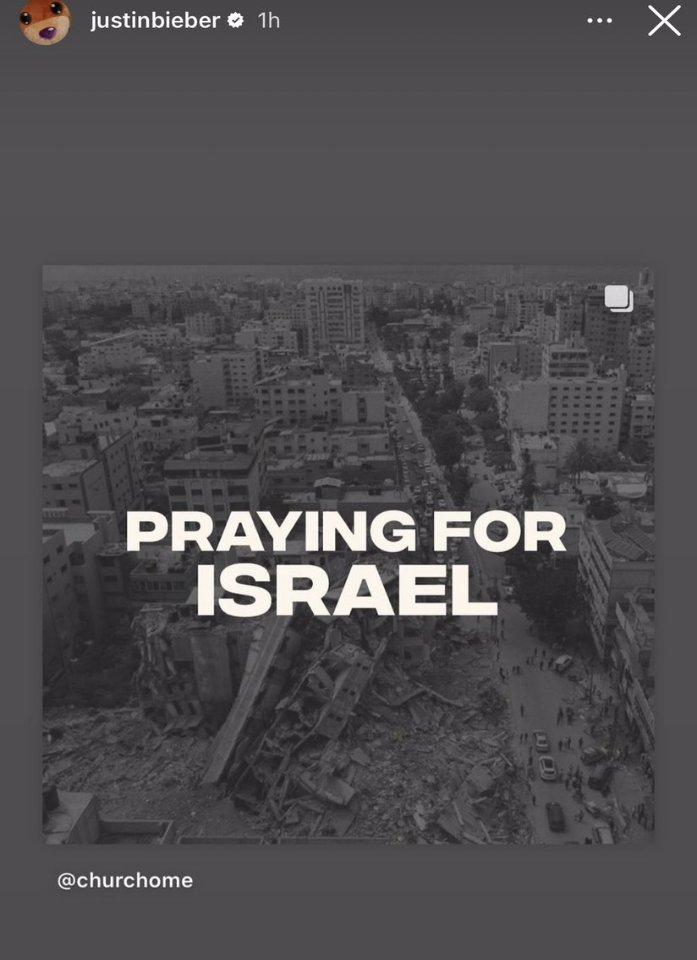
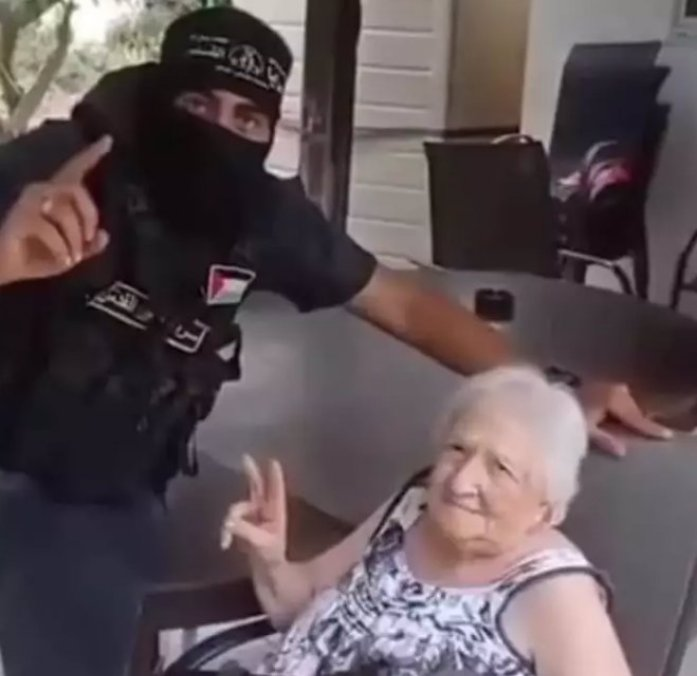
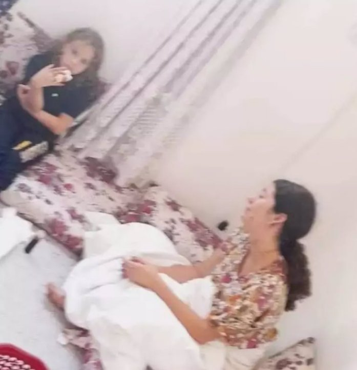

Thread No. 2

This thread is addressed to all non-Arab Twitter users , in this thread I will explain the hypocrisy and overturning the facts that the international media is doing and how public awareness of lies and hypocrisy is being formed

What if I told you that all the photos that celebrities have used to support Israel are photos from Gaza , for example, but not limited to the photo that Justin Bieber put of ruins, are the ruins of Gaza and not the ruins of Israel.

American actress Lee Curtis published a leaflet calling for an end to the killing of Israeli children, while those who appear in the picture are only Palestinian children !!!

Now what about the fact that the resistance treats the prisoner without mercy and kills and tortures them, the prisoner was not injured unless they were conscripts in the Israeli army

Here are examples of "civilian" prisoners in the homes of Palestinians

While the whole world promotes the lie that the resistance in Palestine is killing and abusing prisoners , the resistance releases a woman and her children in front of the eyes of the whole world

While it is said in the Western media that the resistance broke into houses, raped women and killed children, this is a video of the moment of breaking into one of the Houses of the occupation

While it is said in the Western media that the resistance broke into houses, raped women and killed children, this is a video of the moment of breaking into one of the Houses of the occupation

[ht t ps : / / vi deo. t wi mg. com/ ext \_t w_vi deo/ 171 2245192856666112/ pu/ vi d/ avc1/ 494x270/ QDY](https://video.twimg.com/ext_tw_video/1712245192856666112/pu/vid/avc1/494x270/QDYplgdr3vTqfT4u.mp4?tag=12)

pl gdr 3vTqf T4u. mp4?t ag=12

I will translate for you what is said : "Don't worry , no one will hurt you , no one will hurt her , she is a mother of children, she is a civilian."

This is while the resistance accused of rape is trying to cover the women with more clothes, and this is with the testimony of the hostages themselves

[ht t ps : / / vi deo. t wi mg. com/ ext \_t w_vi deo/ 171 2245947495841792/ pu/ vi d/ avc1/ 800x450/ oR6](https://video.twimg.com/ext_tw_video/1712245947495841792/pu/vid/avc1/800x450/oR6g0m1JUlud0RYb.mp4?tag=12)

g0m1J Ul ud0RYb. mp4?t ag=12

We now turn to another lie , it was promoted on special pages in the International and Israeli media that the resistance slaughtered 40 children and the world took the news with shock and amazement and demanded death and extermination for all Palestine....

 news was denied a day and a half later , during this period the whole world was charged against Palestine and the denial of the news did'nt cast the same shock as his announcement, do you know if you publish this news, even out of ignorance, you are a participant in the crime !

Did you know that since 2000, the Israeli forces have killed almost 3 thousand Palestinian children (these are the only recorded numbers) the truth is much bigger

But if the killing of babies attracts your sympathy, I'll tell you some of them, perhaps you will sympathize with us!

Another case that attracted the sympathy of the whole world and their charge against the Palestinians is the case of the German girl Shani , who was promoted by the media that the Resistance killed her at a concert and raped her, Shani is alive ....

and receiving treatment for a head injury only as a result of escaping during the resistance's entry into the occupation territories

This is a video in which her mother talks about it, and demands to get her out of Gaza to receive treatment in her native country

[ht t ps : / / vi deo. t wi mg. com/ ext \_t w_vi deo/ 171 2247183267758081/ pu/ vi d/ avc1/ 1280x720/ bn eqgLdk22Pkul vL. mp4?t ag=12](https://video.twimg.com/ext_tw_video/1712247183267758081/pu/vid/avc1/1280x720/bneqgLdk22PkulvL.mp4?tag=12)

And for more transparency, yes, the prisoners are taken by force if they refuse, so that they can be exchanged in deals

Did you know that the Israeli civilian = the release of 1K Palestinian prisoners, and if he is a conscript, he is worth more , isn't this form of resistance ?

If yes, the resistance captures many recruits and civilians, but they are not abused in advance , they are used to remove harm from Palestinian civilians

A hostage was threatened to be executed every hour if Israel did not stop shelling civilians and the shelling continues

Why is the world turning a deaf ear and closing its eyes to a video on the account of the Prime Minister of Israel in which he brags about bombing unarmed civilians with the most heinous types of missiles

It is promoted that the resistance kills civilians, while Israel kills only soldiers

See for yourself the statistics since 2008 and just tell me who has the most luck of killing civilians ?

Who has more military capability and weapons ! Who even owns these records !

I'm not a media person , I'm not a journalist, I don't have a lot of information and sources, I don't want to clarify and deny all the rumors here . I can't do that

All I ask of you, brother, as a reasonable person, is that you leave all interests, leave the flags of your country, judge for yourself and decide who you will support

We are in an era when the media cannot lie for a long time, please, if your country is out of this conflict, either remain silent or investigate before spreading rumors that could take the lives of millions !

The Israeli leadership used the rumors I mentioned above to bomb civilians and use internationally banned phosphate gas rockets without being blamed by the world

Please, leave political interests behind, consult your heart and mind, support the weak , be a voice for the oppressed from the whole world for the sake of international interests, be a human being #PRAY_FOR_PALESTINE

#SupportPalestine

#Reveal_the_truth

