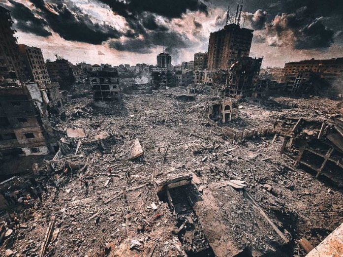

ﻧﺴﺨﺔ ﻓﺮﻧﺴﯿﺔ - version française

Ce tweet s'adresse à tous les utilisateurs non arabes de Twitter. Dans ce fil, j'expliquerai l'hypocrisie et la manipulation des faits perpétrées par les médias internationaux, ainsi que la manière dont la conscience publique se forme en réaction à ces mensonges et cette hypocrisie.

Et si je vous disais que toutes les photos que les célébrités ont utilisées pour soutenir Israël sont des photos de Gaza, par exemple, mais pas seulement la photo que Justin Bieber a publiée des ruines, ce sont les ruines de Gaza et non les ruines d'Israël.

L'actrice américaine Lee Curtis a publié une brochure appelant à la fin du meurtre d'enfants israéliens, alors que ceux qui apparaissent sur la photo ne sont que

des enfants palestiniens !!!

Maintenant, en ce qui concerne le fait que la résistance traite les prisonniers sans pitié, les tue et les torture, les prisonniers ne sont pas blessés sauf s'ils sont des conscrits dans l'armée israélienne. Voici des exemples de prisonniers "civils" dans les maisons des Palestiniens.

Alors que la communauté internationale continue de propager la fausse idée selon laquelle la résistance en Palestine tue et maltraite ses prisonniers, celle-ci libère devant le monde entier une femme et ses enfants.

Malgré les déclarations des médias occidentaux affirmant que la résistance a pénétré dans des domiciles, agressé des femmes et tué des enfants, cette vidéo capture le moment où l'une des maisons de l'occupant a été envahie.

Pendant que les médias occidentaux déclarent que la résistance s'est introduite de force dans des résidences, a commis des agressions sexuelles sur des femmes et a tué des enfants, cette vidéo montre le moment où l'une des maisons de l'occupant a été pénétrée.

Je vais vous traduire ce qui est dit : "Ne vous inquiétez pas, personne ne vous fera de mal, personne ne lui fera de mal, elle est une mère d'enfants, elle est une civile."

Dans le contexte où la résistance est accusée de viols, elle s'efforce de protéger les femmes en les couvrant davantage de vêtements, comme en témoignent les prisonniers eux-mêmes.

Nous en venons maintenant à une autre fausse information qui a été propagée sur des pages spéciales des médias internationaux et israéliens. Selon cette fausse information, la résistance aurait massacré 40 enfants, ce qui a choqué et étonné le monde, conduisant à des demandes de mort et d'extermination pour toute la Palestine.

Une information fausse a été diffusée sur la Palestine. Elle a été réfutée un jour et demi plus tard, mais d'ici là, la communauté internationale s'était déjà tournée contre la Palestine. La réfutation n'a pas eu le même impact que l'annonce initiale.

Saviez-vous que depuis l'an 2000, les forces israéliennes ont tué près de 3 000 enfants palestiniens (ce ne sont que les chiffres enregistrés) alors que la réalité est bien plus importante ?

Cependant, si les décès tragiques des nourrissons éveillent en vous des émotions de compassion, je vais partager avec vous quelques-unes de leurs histoires. Peut-être pourrez-vous ainsi mieux comprendre la gravité de notre situation et ressentir de la tristesse à cet égard.

Un autre cas qui a suscité la compassion du monde entier et leur accusation envers les Palestiniens est celui de la jeune Allemande Shani. Les médias ont affirmé que la résistance l'avait tuée lors d'un concert et l'avait agressée sexuellement, alors que Shani est

bien vivante...

Elle reçoit actuellement des soins pour une blessure à la tête, résultant uniquement de sa fuite lors de l'entrée de la résistance dans les territoires occupés. Une vidéo montre sa mère en train d'en parler et demandant qu'elle soit autorisée à quitter Gaza pour recevoir des soins dans son pays d'origine.

Pour plus de clarté, il est important de noter que les prisonniers sont souvent capturés de force s'ils refusent d'être échangés lors de négociations. En Israël, la libération d'un civil israélien peut conduire à la libération d'un grand nombre de prisonniers palestiniens, et si cette personne est un conscrit, sa libération a encore plus de valeur. Ce type de négociation de prisonniers est effectivement une forme de résistance dans le contexte du conflit israélo- palestinien.

En effet, la résistance capture un certain nombre de recrues et de civils, mais elle ne les traite pas brutalement dès le départ. Au lieu de cela, ils sont utilisés comme moyen de dissuasion pour pousser Israël à cesser de cibler les civils palestiniens. Il est arrivé que des otages soient menacés d'exécution à intervalles réguliers si Israël ne mettait pas fin à ses bombardements sur les zones civiles, cependant, les bombardements ont persisté.

Pourquoi le monde ferme-t-il les yeux sur une vidéo sur le compte du Premier ministre israélien dans laquelle il se vante de bombarder des civils non armés avec les types de missiles les plus odieux ?

Il est promu que la résistance tue des civils, tandis qu’Israël ne tue que des soldats. Voyez par vous- même les statistiques depuis 2008 et dites-moi qui a le plus de chance de tuer des civils ? Qui a plus de capacité militaire et d’armes ! Qui possède même ces enregistrements !

Je ne suis pas une personne des médias, je ne suis pas journaliste, je n’ai pas beaucoup d’informations et de sources, je ne veux pas clarifier ni nier toutes les rumeurs ici. Je ne peux pas faire ça.

Je vous demande, en tant que frères et personnes raisonnables, d'oublier vos intérêts personnels, de ne pas vous laisser influencer par les drapeaux de votre pays, et de prendre une décision impartiale en vous basant sur vos propres convictions.

Nous sommes dans une époque où les médias ne peuvent pas mentir longtemps, s’il vous plaît, si votre pays est hors de ce conflit, soit restez silencieux, soit enquêtez avant de répandre des rumeurs qui pourraient coûter la vie à des millions !

Les dirigeants israéliens ont utilisé les rumeurs que j'ai mentionnées ci-dessus pour bombarder des civils et utiliser des roquettes au phosphore, qui sont interdites au niveau international, sans être blâmés par le monde.

Veuillez laisser les intérêts politiques de côté, consultez votre cœur et votre esprit, soutenez les faibles, soyez une voix pour les opprimés du monde entier dans l'intérêt des intérêts internationaux, soyez un être humain.

#PRAY_FOR_PALESTINE #Support_Palestine #Reveal_the_truth
