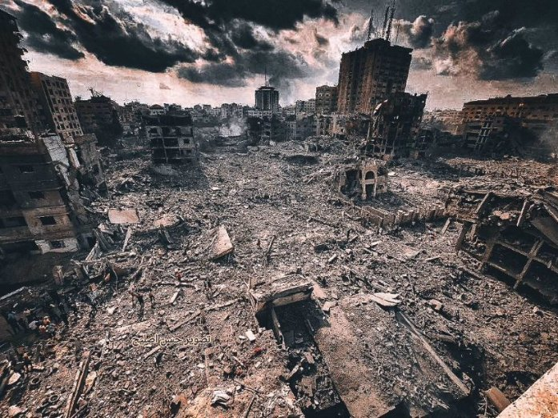

Русская версия- ﻧﺴﺨﻪ روﺳﯿﺔ

Тема Номер 2

Этот пост адресован всем неарабским пользователям Твиттера, в этом посте я объясню лицемерие и опрокидывание фактов, которые творят международные СМИ, и как формируется общественное осознание лжи и лицемерия.

Что, если бы я сказал вам, что все фотографии, которые знаменитости использовали в поддержку Израиля, - это, например, фотографии из Газы, но не ограничиваясь фотографией, которую Джастин Бибер сделал с руинами, - это руины Газы, а не руины Израиля.

Американская актриса Ли Кертис опубликовала листовку, призывающую положить конец убийствам израильских детей, в то время как на снимке изображены всего лишь палестинские дети!!!

А как насчет того факта, что сопротивление обращается с заключенными без пощады, убивает и пытает их, заключенный не пострадал, если только он не был призывником в израильской армии?

Вот примеры «гражданских» заключенных в домах палестинцев

В то время как весь мир пропагандирует ложь о том, что сопротивление в Палестине убивает и издевается над заключенными, сопротивление освобождает женщину и ее детей на глазах у всего мира.

Хотя в западных СМИ говорится, что участники сопротивления врывались в дома, насиловали женщин и убивали детей, это видео момента вторжения в один из домов оккупационных сил.

Я переведу для вас то, что сказано: «Не

волнуйтесь, вас никто не обидит, ее никто не обидит, она мать детей, она гражданское лицо».

Это в то время как обвиняемое в изнасиловании сопротивление пытается прикрыть женщин большим количеством одежды, и это при показаниях самих заложников.

Теперь мы обратимся к другой лжи: на специальных страницах международных и израильских средств массовой информации рекламировалось, что сопротивление убило 40 детей, и мир воспринял эту новость с шоком и изумлением и потребовал смерти и истребления всей Палестины…

новость была опровергнута через полтора дня, в этот период весь мир был обвинен против Палестины и опровержение новости не вызвало такого же шока, как его заявление, знаете ли вы публикуете эту новость, даже по незнанию , вы участник преступления !

Знаете ли вы, что с 2000 года израильские силы убили почти 3 тысячи палестинских детей (это единственные зафиксированные цифры), правда гораздо больше

Но если убийство младенцев вызовет ваше сочувствие, я расскажу вам некоторые из них, возможно, вы посочувствуете нам!

Еще один случай, вызвавший сочувствие всего мира и их обвинение в адрес палестинцев, это дело немецкой девушки Шани, которой СМИ раскрутили, что Сопротивление убило ее на концерте и изнасиловало, Шани жива....

и получение лечения от травмы головы только в результате побега во время вторжения сопротивления на оккупационные территории

Это видео, на котором об этом рассказывает ее мать и требует вывезти ее из Газы для лечения на родине.

А для большей прозрачности да, пленных

забирают силой, если они отказываются, чтобы их можно было обменять в сделках

Знаете ли вы, что израильский гражданский = освобождение 1 тыс. палестинских заключенных, и если он призывник, то он стоит большего, разве это не форма сопротивления?

Если да, то сопротивление захватывает многих новобранцев и гражданских лиц, но их заранее не подвергают насилию, а используют для устранения вреда палестинским гражданам.

Каждый час угрожали казнить заложника, если Израиль не прекратит обстрел мирных жителей и обстрелы продолжатся

Почему мир игнорирует и закрывает глаза на видео на счету премьер-министра Израиля, в котором он хвастается бомбардировками безоружных мирных жителей самыми отвратительными типами ракет

Пропагандируется, что сопротивление убивает мирных жителей, а Израиль убивает только

солдат.

Посмотрите сами статистику с 2008 года и скажите мне, кому больше всего везет в убийствах мирных жителей?

У кого больше военной мощи и вооружения! Кому вообще принадлежат эти записи!

Я не медийный человек, я не журналист, у меня не так много информации и источников, я не хочу уточнять и опровергать все здесь существующие слухи. я не могу этого сделать

Все, что я прошу тебя, как разумного человека, это чтобы ты оставил все интересы, оставил флаги своей страны, суди сам и решай, кого ты будешь поддерживать.

Мы живем в эпоху, когда средства массовой информации не могут долго лгать, пожалуйста, если ваша страна вышла из этого конфликта, либо храните молчание, либо проводите расследование, прежде чем распространять слухи, которые могут унести жизни миллионов людей!

Израильское руководство использовало слухи, о которых я упоминал выше, чтобы бомбить мирное население и использовать запрещенные на международном уровне ракеты на фосфатном газе, не подвергаясь при этом обвинению со стороны мира.

Пожалуйста, оставьте политические интересы позади, посоветуйтесь со своим сердцем и разумом, поддержите слабых, будьте голосом угнетенных всего мира ради международных интересов, будьте человеком. #Молитесь_За_Палестину #Поддерживать_Палестину

#Раскрой_Правду

