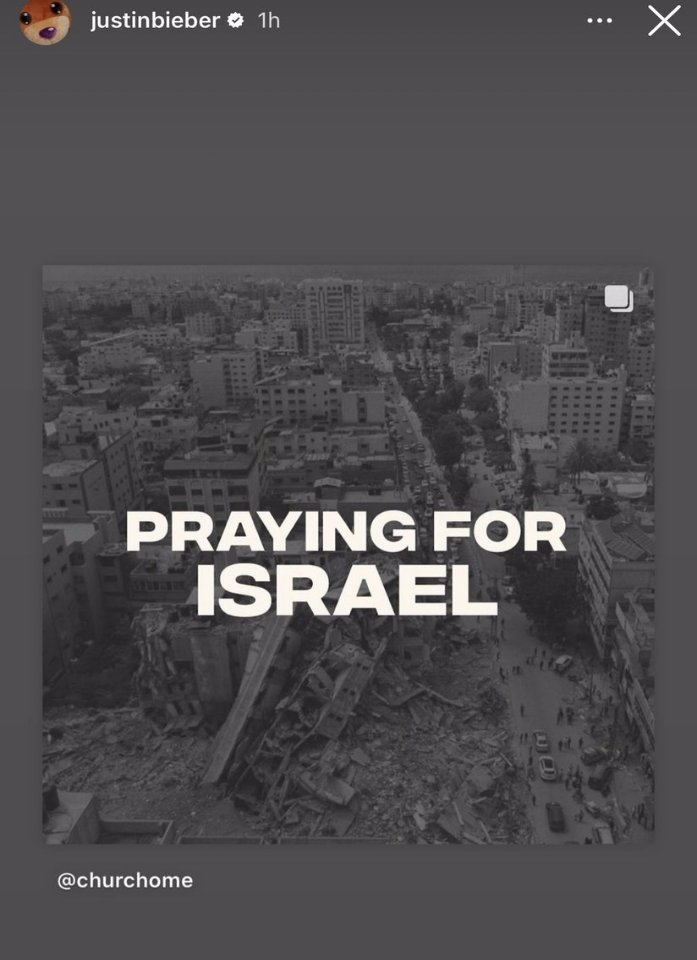

Thread no. 2 svensk version -اﻟﻨﺴﺨﺔ اﻟﺴﻮﯾﺪﯾﺔ  
Denna tråd riktar sig till alla icke-arabiska Twitter- användare, i den hör tråden kommer jag att förklara hyckleriet ocj störta fakta som internationella medier gör och hur allmänhetens medvetenhet om lögner och hyckleri bildas.

Tänk dig att jag berättar till dig att alla bilder som kändisar har använt för att stödja Israek är foton tagna i Gaza, till och med den foto som Justin Bieber delade av ruiner, runierna som han delade var i Gaza och inte i Israel.

Den amerikanska skådespelerskan Lee Curtis publicerade en broschyr som uppmanade till ett slut på dödandet av israeliska barn, men egentligen är de barn som visas på bilden är palestinska barn!!

Hur är det nu med faktumet att motståndet behandlar fången utan nåd och och dödar och torterar dem, fången skadades inte om de inte var värnpliktiga i den israeliska armén.

Här är exempel på "civilia" fångare i palestiniernas hem.

Medan hela världen främjar lögnen om att det palestinska motståndet dödar och misshandlar fångar, släpper motståndet en kvinna och hennes två barn fria framför hela världens ögon.

Medan det sägs i västerländska medier att det palestinska motståndet bröt sig in i flera hus, våldtog kvinnor och dödade barn, detta är en video av det ögonblicket då de bröt in i ett av ockuperades hus.

Låt mig översätta för er vad som sägs i videon: "Oroa dig inte, ingen kommer att skada dig, ingen gör något skada mot henne, hon är en mamma till barn, hon är en civil."

Detta är medan det palestinska motståndsrörelsen

som anklagas för våldtäkt samtidig försöker att täcka kvinnorna med fler klädplagg, och detta är med gisslans vittnesmål.

Vi vänder oss nu till en till lögn, det främjades på specialsidor i internationella och israeliska medier att palestinska motståndet slaktade 40 barn och världen tog nyheterna med chock och förvåning och krävde död och utrotninh för alla hela Palestinas befolkning.

Men dessa nyheter nakades efter en och en halv dag, under denna period anklagades hela världen mot Palestina och förnekandet av nyheterna gav inte samma chock som hans tillkännagivande. Så vet du i fall du publicerade om denna nyheten, även av okunnighet, då är du en deltagare i brottet!

Visste du att sedan 2000 har de israeliska styrkorna dödat nästan 3000 palestinska barn ( detta är de enda registrerade siffrorna) i verkligheten är det ett större tal.

Men om dödandet av spädbarn lockar din sympati,

ska jag berätta några av dem, kanske du kommer att sympatisera med oss!

Ett annat fall som väckte sympati från hela världen och deras anklagelse mot palestinierna är fallet med den tyska tjejen Shani, som främjades av media att palestinska motståndsrörelsen dödade henne på en konsert och våldtog henne, men Shani lever fortfarande utam att någobn skada har nått henne...

Och dessutom hon får behandling för endast en huvudskada till följd av att de rymt under palestinska motståndets intåg i ockupationensområdena.

Under threaden kan ni hitta en video av hennes mamma där mamman talar om det och kräver att få sin dotter ut från Gaza för att få behandling i sitt hemland, Tyskland.

Och för mer insyn, ja, fångarna tas med våld om de vägrar, så att de kan bytas ut i överkommelser

Visste du att den israeliska civilien = frigivningen av 1000 palestinska fångar, och om han är värnpliktig är hen värd mer, är inte denna form av motstånd?

Om ja, motståndet fångar många rekryter och civila, men de missbrukas inte i förväg, de används för att ta bort skada från civila palestinier

En gisslan hotades att avrättas varje timme om Israel inte slutar beskjuta civila och beskjutningen fortsätter fortfarande.

Varför slår världen dövörat till och blundar för en video på Israels premiärministers konto där han skyter med stolthet om att han bombade obeväpnade civila med de mest avskyvärda typerna av missiler

.

 om Det främjas att palestinska motståndet dödar civila, medan Israel bara dödar soldater

Se själv statistiken sedan 2008 och upptäck själv vem som hat störst tur att kunna döda civila? (Bilden kan hittas i den engelska version threaden)

Vem har mer militär kapacitet och vapen! Vem äger ens dessa rekorder!

Jag är inte en mediamänniska, jag är inte en

journalist, jag har inte så mycket information och källor, jag vil inte förtydliga och dementera alla rykten här. Jag kan inte göra det..

Allt jag önskar från er, s en mogen person, är att du lämnar alla intressen, lämnar ditt lands flaggor, döm själv och bestäm själv vem du ska stödje

Vi befinner oss i en era där media inte kan ljuga på länge, snälla, om ditt land är utanför denna konflikt, håll antingen tyst eller undersök innan ni och de sprider falska rykten som kan ta livet av miljoner!

De israeliska ledare använde de falska ryktena, som är nämnde ovan, för att få anledningar för att kunna bomba civila och använde internationellt förbjudna fosforgasraketer utan att skyllas av världen

Snälla, lämna politiska intressen bakom dig, rådfråga ditt hjärta och ditt sinne, stöd de svaga, var en röst för de förtryckta från hela världen för internationella intressens skull var en människa
