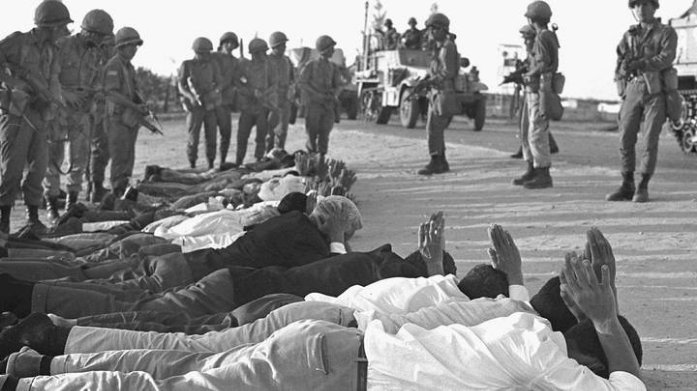
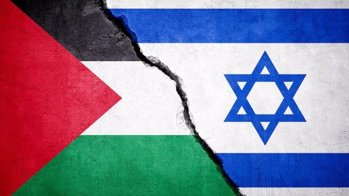
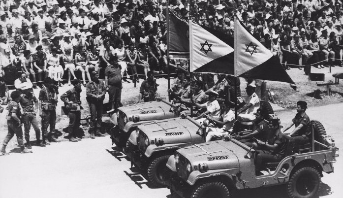
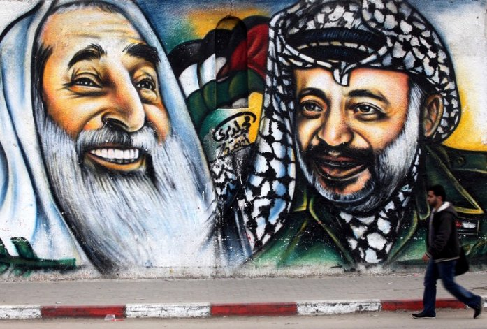
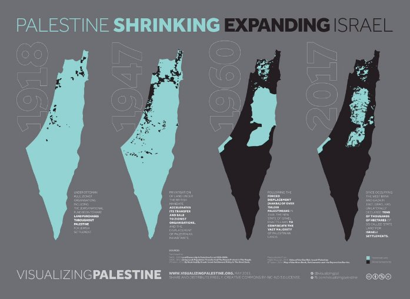
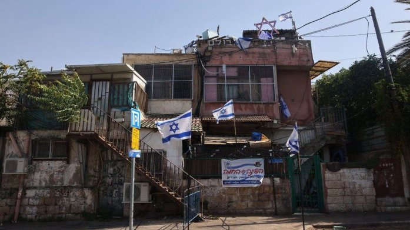

This tweet is addressed to non-Arab Twitter users If you don't know the whole truth, here's a simple historical summary to clarify things for you:

The ongoing war between Israel and Palestine is not a war between two states, so the attack of the Palestinian resistance is not a declaration of war, but only a reaction to ...

violations that have been taking place for more than 70 years .

For more than a century, the Palestinian Territories belonged to the Ottoman Empire

During World War I, as the empire faltered , eventually giving way to the Republic of Türkiye –– Britain seized it.

In 1917, the British Foreign Secretary, in a letter to Lionel Rothschild, declared his full support for the establishment of a Jewish state on the Palestinian Territories

We call this promise “A promise from someone who does not possess to someone who does not deserve”

At the beginning of the implementation of this fateful promise, the number of Jews in Palestine was 7%, this percentage increased to 28% of the total population after the immigration of European Jews to Palestine under the British protectorate

After the end of World War II, the United Nations issued a resolution on the partition of Palestine between Arabs and Jews in 1947

On May 14, 1948, the leaders of Israel met at the Tel Aviv Museum and announced the end of the British Mandate and the establishment of the state of Israel was recognized by the United States of America and the Soviet Union

The 1948 War

Many Arab countries rejected the occupation of Palestine and its partition by the United States unjustly, and many wars were won in which Israel won with the support of America and took areas of land larger than the one declared by the United States

 Many armed and unarmed Palestinian organizations were formed and had one demand, which was the liberation of their state, which was divided and occupied unjustly

Violations against the Palestinian people are carried out on a daily and systematic basis there are more than 100 thousand registered martyrs / twice this number has not been counted and there are more than a million killed

The attacks are carried out in various aspects of life, including education, health, supplies that are constantly being cut off, violations of religious sanctities and provocation on all occasions and holidays

Israel does'nt want to give the Palestinians peace, as it claims, and does'nt want establish a state for Palestinians next to their so-called state, as the UN claims, the Palestinian map is shrinking dayily while the territories controlled by the Israeli occupation are expanding

Google for Sheikh Jarrah neighborhood , and you will see violations and settlement

The Palestinian resistance is only a reaction to daily violations that occur and no one talks about them

if you are a free person, you certainly will not accept all this hypocrisy and Distortion of facts from the international community

Pray for Palestine and support Palestine

Thes e pages wer e cr eat ed and ar r anged by Rat t i bha

s er vi ces ( ht t ps : / / www. r at t i bha. com)

The cont ent s of t hes e pages , i ncl udi ng al l i mages ,

vi deos , at t achment s and ext er nal l i nks publ i s hed

( col l ect i vel y r ef er r ed t o as "t hi s publ i cat i on") ,

wer e cr eat ed at t he r eques t of a us er ( s ) f r om X.

Rat t i bha pr ovi des an aut omat ed s er vi ce, wi t hout human i nt er vent i on, t o copy t he cont ent s of t weet s f r om X and publ i s h t hem i n an ar t i cl e s t yl e, and cr eat e PDF pages t hat can be pr i nt ed and s har ed, at t he r eques t of X us er ( s ) . Pl eas e not e t hat t he vi ews and al l

cont ent s i n t hi s publ i cat i on ar e t hos e of t he aut hor and do not neces s ar i l y r epr es ent t he vi ews of

Rat t i bha. Rat t i bha as s umes no r es pons i bi l i t y f or any damage or br eaches of any l aw r es ul t i ng f r om t he

cont ent s of t hi s publ i cat i on.
