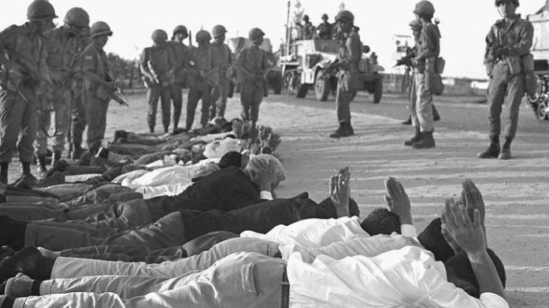

Svensk version- ﻧﺴﺨﺔ اﻟﺴﻮﯾﺪ

Detta inlägg är riktat till icke-arabiska Instagram- användare. Om du inte känner till hela sanningen, här är en enkel historisk sammanfattning för att klargöra saker för dig:

Den pågående konflikten mellan Israel och Palestina är inte en krig mellan två stater, så attacken från den palestinska motståndsrörelsen är inte en krigsförklaring, utan endast en reaktion på överträdelser som har pågått i mer än 70 år.

I över ett sekel tillhörde de palestinska områdena Osmanska riket. Under första världskriget, när riket föll samman och ersattes av Republiken Turkiet, besatte Storbritannien området. 1917 skrev Storbritanniens utrikesminister i ett brev till Lionel Rothschild och uttryckte sitt fulla stöd för etableringen av en judisk

stat på de palestinska områdena. Vi kallar detta löftet "Ett löfte från någon som inte äger till någon som inte förtjänar det."

I början av genomförandet av detta ödesdigra löfte utgjorde judarna i Palestina 7% av befolkningen. Detta procenttal ökade till 28% av den totala befolkningen efter invandringen av europeiska judar till Palestina under brittiskt beskydd.

Efter andra världskriget utfärdade FN en resolution om uppdelning av Palestina mellan araberna och judarna år 1947. Den 14 maj 1948 samlades Israels ledare på Tel Aviv-museet och tillkännagav slutet på det brittiska mandatet samt erkännandet av staten Israel av USA och Sovjetunionen.

År 1948-kriget:

Många arabländer avvisade ockupationen av Palestina och dess uppdelning av Förenta staterna. Det utkämpades många krig där Israel vann med amerikansk hjälp och tog områden som var större än vad USA hade deklarerat.

Många beväpnade och obeväpnade palestinska organisationer bildades med ett enda krav: befrielse av deras stat, som delades och ockuperades orättvist.

Övergrepp mot det palestinska folket äger rum dagligen och systematiskt. Det finns mer än 100 000 registrerade martyrer, och dubbelt så många har inte ens räknats. Över en miljon har dödats. Attackerna äger rum inom olika områden av livet, inklusive utbildning, hälsa, tillförsel som ständigt bryts, kränkningar av religiösa helgedomar och provocering vid alla tillfällen och helgdagar.

Israel vill inte ge palestinierna fred, som de hävdar, och vill inte heller etablera en stat för palestinierna bredvid deras så kallade stat, som FN hävdar. Den palestinska kartan krymper varje dag medan territorierna som kontrolleras av den israeliska ockupationen utökas.

Sök på Google efter Sheik Jarrah-kvarteret, och du kommer att se överträdelser och bosättningar. Den palestinska motståndet är bara en reaktion på de dagliga överträdelserna som äger rum, och ingen talar om dem.

Om du är en fri person kommer du säkerligen inte acceptera all denna hyckleri och förvrängning av fakta från den internationella gemenskapen. Be för Palestina och stöd Palestina.

